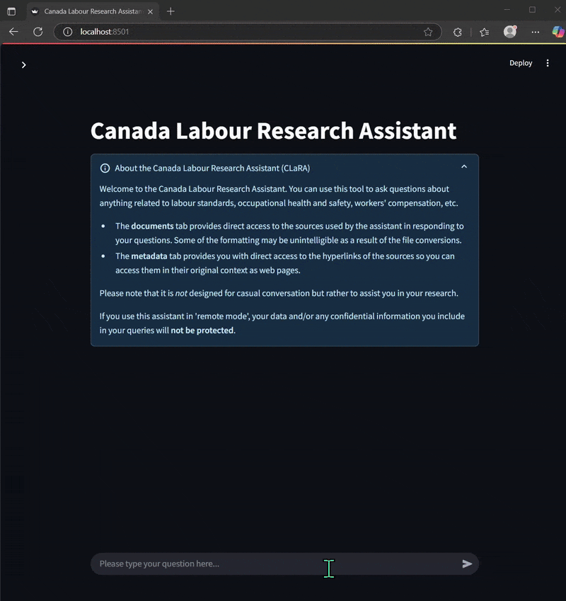
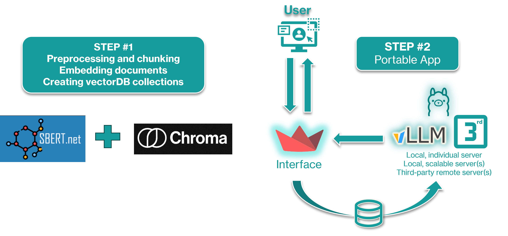

<h1 align="center">
  <strong><font size=7>Canada Labour Research Assistant (CLaRA)</font></strong><br>
  <sub>An LLM-powered assistant that directly quotes retrieved passages</sub>
</h1>

<p align="center">
  <a href="#key-features">Key Features</a> •
  <a href="#quick-start">Quick start</a> •
  <a href="#use-case-and-portability">Use Case & Portability</a> •
  <a href="#telemetry-and-api-calls">Telemetry & API Calls</a> •
  <a href="#contributions">Contributions</a> •
  <a href="#acknowledgements">Acknowledgements</a>
</p>


The Canada Labour Research Assistant (CLaRA) is a ***privacy-first*** LLM-powered research assistant that ***directly quotes sources*** to mitigate hallucinations and construct context-grounded answers to questions about Canadian labour laws, standards, and regulations. It can be run ***locally and without any Internet connection***, thus ***guaranteeing the confidentiality*** of your conversations.

<details>

  <summary><b><font size="+1">Preview (click to expand)</font></b></summary>

  

</details>



#### CLaRA comes in two builds
* one running on an Ollama serving backend, suitable for experimentation or low user numbers.
* one running on a vLLM serving backend, suitable for use cases requiring more scalability.

<!-- KEY FEATURES -->
## Key Features

✅ **Retrieval**-Augmented Generation (RAG) to infuse context in each query.</br>
✅ **Chunking** strategy to improve question answering.</br>
✅ **Metadata leveraging** to improve question answering and make the information easily verifiable.</br>
✅ **Reranking** to prioritize relevant sources when detecting a query mentioning legal provisions.</br>
✅ **Dynamic context window allocation** to prevent source document chunks from getting truncated, and manage memory efficiently.</br>
✅ **Performance optimizations** to reduce latency (*database caching*, *tokenizer caching*, *response streaming*).</br>
✅ **Locally Runs on CPU and/or consumer-grade GPUs** for small and medium enterprises/organizations.</br>
✅ **Production-Ready** for multiple scenarios with two builds offered out-of-the-box (Ollama or vLLM).</br>
✅ **Runs offline** with no Internet connection required (see instructions further below).</br>
✅ **Guaranteed confidentiality** as a result of local-and-offline runtime mode.</br>
✅ **Minimalist set of base dependencies** for more portability and resilience (see pyproject.toml).</br>
✅ **Bring-Your-Own-Model** with Ollama ([or supported pre-trained models](https://ollama.com/library)) and vLLM ([or supported pre-trained models here](https://docs.vllm.ai/en/v0.7.0/models/supported_models.html)).</br>
✅ **Bring-Your-Own-Inference-Provider** and easily switch between two inference modes (local vs. remote) in the UI.</br>
✅ **RAG-enabled conversation history** that includes previous document chunks for deeper context and research.
✅ **UI Databases Dropdown** to easily swap between databases on-the-fly.<br>
✅ **On-the-Fly LoRA Adapters for your Fine-Tuned Models**. With vLLM, simply pass the path to your fine-tuned LoRA adapter.</br>
✅ **3 runtime modes**: normal, evaluation (to assess the LLM answers), or profiling (to track performance).</br>
✅ **Evaluation mode (still in early development)** allows to measure the quality of responses generated.</br>
✅ **Profiling mode** provides analytics to measure the impact of each function call, and component added/subtracted from the architecture.</br>
✅ **Streamlined Installation** process in *one easy step* (*Ollama build only; we've streamlined the installation of the vLLM build nonetheless, see quick start - build #2 below).</br>


<!-- GETTING STARTED -->
## Quick Start

<details>

<summary> How to set up this system for 100% local-and-off-the-Internet inference</summary>

<br>Because models require tokenizers, and because the open source models we use both for the embedding of documents and for LLM inference are stored on [Hugging Face](https://huggingface.co/), the methods and functions coming with libraries like `sentence-transformers` are on the first call pulling the models and tokenizers, then saving a copy in a cache to increase future performance (see e.g. the definition of the `SentenceTransformer` class).

Once you have downloaded the models, you can still use these libraries locally, without the need for any Internet connection. The same can be done with the LLM's tokenizer in order to avoid making external calls unnecessarily (this is what we've done with the [.tokenizers](.tokenizers) folder)

For LLM inference, you can do the same thing and download the LLM model, store its main files, then run the system completely offline.

</details>


<details>

<summary> Build #1 - Ollama local server & (optional) remote server</summary>

#### Preliminary Steps
Ensure you have Ollama installed and a bash terminal available. Then, clone this repo and cd into the new directory:
```sh
git clone https://github.com/pierreolivierbonin/Canada-Labour-Research-Assistant.git
cd canada-labour-research-assistant
```

#### All-in-one setup
Run `full_install_and_launch_pipeline.sh`.

If you prefer to do it one step at a time:

#### Step 1
Install the virtual environment by running the following command in your bash terminal:
```sh
./install_venv.sh
```


#### Step 2
Make sure your virtual environment is activated. Then, create the database by running the following command in a terminal:
```sh
./create_or_update_database.sh
```

#### Step 3

You are now ready to launch the application with: 
```sh
./run_app_choose_mode.sh
``` 

You can now enter the mode of your choice in the console to run the application. 

The default mode to enter in the console is 'local', *i.e.* **local mode**. It will run and use your machine to run the application, thereby protecting your privacy and data.

Should you want to use **remote mode** and take advantage of third party compute for larger models and workloads, it is possible to do so, and to switch between each mode on-the-fly through the UI's toggle button. Please note that **the privacy of your conversations will not be guaranteed anymore** if you do so.

To enable **remote mode**, simply add the necessary credentials in `.streamlit/secrets.toml`, following the format below:

> authorization = "<api_key>" <br>
> api_url = "<api_url>"

Then, enter 'remote' in the console when launching the app. Streamlit will pick up those credentials and use them to call the API you chose as your third-party inference provider. You can always switch back to local mode later on through the UI if need.

</details>

<details>
<summary> Build #2 - vLLM local server & (optional) remote server</summary>

#### Preliminary Step
For Windows users: [install WSL2](https://learn.microsoft.com/en-us/windows/wsl/install) to have a Linux kernel.

Then, install the drivers as appropriate to run [GPU paravirtualization on WSL-Ubuntu](https://developer.nvidia.com/cuda-downloads?target_os=Linux&target_arch=x86_64&Distribution=WSL-Ubuntu&target_version=2.0).

If you intend to use LoRA adapters, install `jq` by running `sudo apt-get install jq`.

#### Step #1
Install the virtual environment by running:
```sh
source ./install_venv_vllm.sh
```

#### Step #2
Activate your virtual environemnt with `source .venv/bin/activate`, then run:

```sh
./create_or_update_database.sh
```

#### Step #3
Launch the application with:
```sh
source ./run_app_vllm.sh
```

By default, **local mode** will run and use your machine to run the application, thereby protecting your privacy and data.

**Please note:** while running on WSL, vLLM sometimes has trouble releasing memory once you shutdown or close your terminal. To make sure your memory is released, run `wsl --shutdown` in another terminal.

Should you want to use **remote mode** and take advantage of third party compute for larger models and workloads, it is possible to do so, and to switch between each mode on-the-fly through the UI's toggle button. Please note that **the privacy of your conversations will not be guaranteed anymore** if you do so.

To enable **remote mode**, simply add the necessary credentials in `.streamlit/secrets.toml`, following the format below:

> authorization = "<api_key>" <br>
> api_url = "<api_url>"

Once this setup completed, you will be able to switch to **remote mode** via the UI.


</details>

<!-- USAGE EXAMPLES -->
## Use Case and Portability
You can use this solution for your own use case by changing the hyperlinks of the [WebCrawlConfig](./src/db_config.py). Then, you extract the text you need, and create a vector database for Retrieval-Augmented Generation. 

The solution is designed so you can easily verify the information used by the LLM to construct its responses. To do so, 'direct quotations' mode will format and highlight relevant passages taken from the sources. You can click on these passages to directly go to the source and validate the information. 

Using the current configuration of for webcrawling, you can create two distinct databases and swap between each of them in the UI. Each database includes the following documents:

Labour Database:
* Canada Labour Code (CLC)
* Canada Labour Standards and Regulations (CLSR)
* Interpretations, Policies, and Guidelines (IPGs)
* Canada webpages on topics covering: labour standards, occupational health and safety, etc.

Equity Database:
* Workplace equity, etc.

<!-- Privacy -->
## Telemetry and API Calls
In an effort to ensure the highest standards of privacy protection, we have tested and confirmed that the system works offline, without any required Internet connection, thus guaranteeing your conversations remain private.

In addition, we have researched and taken the following measures:
* ChromaDB allows to disable telemetry, and we've done just that by following the [instructions here](https://docs.trychroma.com/docs/overview/telemetry).  
* Ollama does not have any telemetry. See [this explainer](https://github.com/ollama/ollama/issues/2567).  
* Streamlit allows to disable telemetry, and we've done just that by turning `gatherUsageStats` to 'false'. See [this explainer](https://docs.streamlit.io/develop/api-reference/configuration/config.toml#browser).
* vLLM allows opting out from telemetry using the `DO_NOT_TRACK` environment variable, and we've done just that. See [the doc](https://docs.vllm.ai/en/v0.7.0/serving/usage_stats.html#opting-out) 
* Hugging Face allows disabling calls to its website via the `HF_HUB_OFFLINE` environment variable, and we've done just that. See [this PR](https://github.com/vllm-project/vllm/issues/1910)


<!-- ROADMAP -->
## Roadmap

See the [open issues](https://github.com/pierreolivierbonin/Canada-Labour-Agent/issues) for a full list of proposed features (and known issues).


<!-- CONTRIBUTIONS -->
## Contributions

Contributions are what make the open source community such an amazing place to learn, inspire, and create. Any contributions you make are **greatly appreciated**.

If you have a suggestion that would make this better, please fork the repo and create a pull request. You can also simply open an issue with the tag "enhancement".
Don't forget to give the project a star! Thanks again!

1. Fork the Project
2. Create your Feature Branch (`git checkout -b feature/AmazingFeature`)
3. Commit your Changes (`git commit -m 'Add some AmazingFeature'`)
4. Push to the Branch (`git push origin feature/AmazingFeature`)
5. Open a Pull Request

<!-- LICENSE -->
## License

Distributed under the MIT License. See `LICENSE` for more information.

<!-- ACKNOWLEDGEMENTS -->
## Acknowledgements

We would like to thank everyone who participates in conducting open research as well as sharing knowledge and code. In particular, we are grateful to the creators and contributors who made it possible to build CLaRA:

#### Webcrawling & Preprocessing
* Webcrawling and html processing: [Beautiful Soup](https://www.crummy.com/software/BeautifulSoup/)
* PDF files content extraction: [PyMuPDF](https://pymupdf.readthedocs.io/en/latest/index.html)

#### Backend
* GPU Paravirtualization: [NVIDIA][NVIDIA-url]
* Llama3.2-Instruct model: [Meta](https://ai.meta.com/blog/llama-3-2-connect-2024-vision-edge-mobile-devices/)
* Vector database: [Chroma](https://www.trychroma.com/)
* LLM inference serving: [Ollama][Ollama-url] & [vLLM][vLLM-url]
* Embedding models: [SentenceTransformers](https://www.sbert.net/docs/sentence_transformer/pretrained_models.html) and [Hugging Face](https://huggingface.co/sentence-transformers/multi-qa-mpnet-base-dot-v1)

#### Frontend
* User Interface: [Streamlit][Streamlit-url]

## References
We are grateful to, and would like to acknowledge the AI research community. In particular, we drew ideas and inspiration from the following papers, articles, and conference:

Bengio, Yoshua. "Superintelligent Agents Pose Catastrophic Risks: Can Scientist AI Offer a Safer Path?". Presentation given at the World Summit AI Canada on April 16 (2025).

Bengio, Yoshua, Michael Cohen, Damiano Fornasiere, Joumana Ghosn, Pietro Greiner, Matt MacDermott, Sören Mindermann et al. "[Superintelligent agents pose catastrophic risks: Can scientist ai offer a safer path?.](https://arxiv.org/abs/2502.15657)" arXiv preprint arXiv:2502.15657 (2025).

He, Jia, Mukund Rungta, David Koleczek, Arshdeep Sekhon, Franklin X. Wang, and Sadid Hasan. "Does Prompt Formatting Have Any Impact on LLM Performance?." Online. https://arxiv.org/abs/2411.10541 arXiv:2411.10541 (2024).

Laban, Philippe, Tobias Schnabel, Paul N. Bennett, and Marti A. Hearst. "SummaC: Re-visiting NLI-based models for inconsistency detection in summarization." Transactions of the Association for Computational Linguistics 10 (2022): 163-177. Arxiv: https://arxiv.org/abs/2111.09525. Repository: https://github.com/tingofurro/summac

Lin, Chin-Yew, and Franz Josef Och. "Automatic evaluation of machine translation quality using longest common subsequence and skip-bigram statistics." In Proceedings of the 42nd annual meeting of the association for computational linguistics (ACL-04), pp. 605-612. https://aclanthology.org/P04-1077.pdf. 2004.

Wikipedia. "ROUGE (metric)." Online. https://en.wikipedia.org/wiki/ROUGE_(metric). 2023.

Wikipedia. "Longest common subsequence". Online. https://en.wikipedia.org/wiki/Longest_common_subsequence. 2025.

Yeung, Matt. "Deterministic Quoting: Making LLMs Safer for Healthcare." Online. https://mattyyeung.github.io/deterministic-quoting (2024).


<!-- MARKDOWN LINKS & IMAGES -->
<!-- https://www.markdownguide.org/basic-syntax/#reference-style-links -->
[Ollama-url]: https://ollama.com/
[Streamlit-url]: https://streamlit.io/
[chroma-url]: https://www.trychroma.com/
[vLLM-url]: https://docs.vllm.ai/en/stable/
[NVIDIA-url]: https://docs.nvidia.com/cuda/wsl-user-guide/index.html
[PyMuPDF-url]: https://pymupdf.readthedocs.io/en/latest/index.html


## Citation
If you draw inspiration or use this solution, please cite the following work:

```bibtex
@misc{clara-2025,
  author       = {Bonin, Pierre-Olivier, and Allard, Marc-André},
  title        = {Canada Labour Research Assistant (CLaRA)},
  howpublished = {\url{https://github.com/pierreolivierbonin/Canada-Labour-Research-Assistant}},
  year         = {2025},
}
```

<!-- CONTACT -->
## Contact
[Pierre-Olivier Bonin](https://www.linkedin.com/in/pierreolivierbonin/), [Marc-André Allard](mailto:marca116@hotmail.com)


